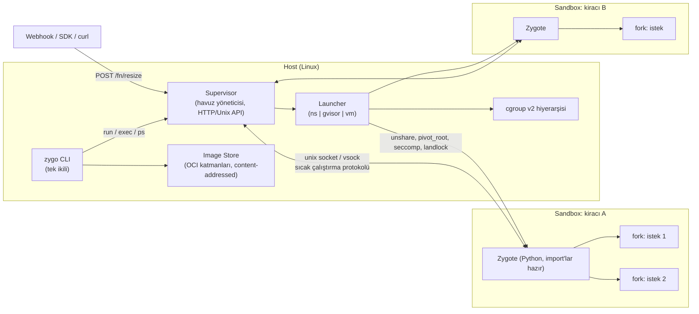

# Zygo — Sıcak Sandbox Runtime

## Tasarım Dokümanı v0.2

| | |
|---|---|
| **Durum** | Taslak v0.2, tartışmaya açık (v0.1 üzerine revizyonlar için bkz. Ek E) |
| **Tarih** | 18 Eylül 2026 |
| **Çalışma adı** | `zygo` (zygote'tan; nihai isim açık) |
| **Hedef okuyucu** | Çekirdek ekip, ilk katkıcılar, mimari kararları gözden geçirecek kişiler |

---

## 0. Özet

Zygo, fonksiyon şeklindeki kodu (webhook handler, agent tool, cron job, veri dönüşümü) Docker'ın bilinen ergonomisiyle ama container yaratma/silme döngüsü olmadan çalıştıran, **daemonsuz, rootless, OCI uyumlu** bir sandbox runtime'ıdır.

Temel fikir üç cümle:

1. **Sandbox bir "container" değil, kısıtlanmış bir işletim sistemi process'idir.** FreeBSD jail modeli: process normal bir process gibi çalışır, çekirdek ona ne göreceğini ve ne yapabileceğini söyler. Docker'ın daemon, overlayfs orkestrasyonu, bridge/NAT ve shim zinciri istek yoluna girmez.
2. **Sandbox sıcak bekler; istek yolunda kurulum yoktur.** Bu her dil için geçerlidir: derlenmiş ikililer hazır sandbox içinde 1–3 ms'de spawn edilir (*warm-exec*). Yorumlayıcı başlangıcının pahalı olduğu dillerde (Python, Node, Ruby, JVM) runtime'a özgü küçük bir *agent* yorumlayıcıyı ve import'ları bir kez ısıtır; her istek `fork()` ya da hazır havuzdan 1–2 ms'de kendi temiz bellek alanında çalışır ve biter. Copy-on-write sayesinde kopyalama yoktur ama istekler birbirinin çöpünü görmez. Protokol dil bağımsız bir spec'tir; Python agent'ı referans implementasyondur.
3. **İzolasyon seviyesi tek bir bayraktır:** `ns` (namespace + cgroup + seccomp + Landlock), `gvisor` (kullanıcı alanı çekirdeği), `vm` (libkrun / Firecracker). Aynı spec dosyası, aynı komut, aynı protokol; sadece sandbox'ı başlatan katman değişir. `ns` ve `vm` ilk sürümde birinci sınıftır; `gvisor` KVM olmayan ortamlar için sonradan gelir.

Tek cümlelik vaat: **`docker run`'ın fonksiyon senaryosu için drop-in muadili; başlatmada 100× hızlı, varsayılan olarak güvenli, tek ikili.**

Teslimat biçimi önce kütüphane (`zygo-core` Rust crate'i + Python/TypeScript binding), sonra onun ince istemcisi olan CLI. Platformlar ve agent framework'leri Zygo'yu process olarak çağırmaz, gömer.

```
$ zygo run python:3.12 hello.py          # ilk çalıştırma: imaj çekilir
$ zygo run python:3.12 hello.py          # ikinci: ~30 ms (çoğu Python'un kendisi)
$ zygo serve ./handler.py --name resize  # sıcak zygote ayağa kalkar
$ zygo exec resize '{"url": "..."}'      # ~1 ms overhead
```

---

## 1. Problem

### 1.1 Senaryo

Windmill benzeri bir otomasyon platformu düşün. Bir webhook gelir; kiracının yazdığı 30 satırlık Python (birkaç pip paketiyle: `requests`, `pydantic`, belki `pandas`) çalışır; sonuç JSON olarak döner. Bu, günde milyonlarca kez, yüzlerce/binlerce farklı kiracı için olur. Kiracılar birbirinin kodunu, verisini ve sırlarını görmemelidir; biri sonsuz döngüye girerse, RAM'i doldurursa ya da fork bomb atarsa diğerleri ve host etkilenmemelidir.

Kodun kendisi çoğu zaman **5–20 ms** çalışır. Bugün onu çalıştırmak için ödenen bedel bunun 20–100 katıdır.

### 1.2 Docker'ın maliyet yapısı

Docker ile "her istekte container aç, bitince sil" yaklaşımının maliyeti aşağı yukarı şöyle dağılır (tipik sunucu, ısınmış imaj cache'i):

| Adım | Süre | Notlar |
|---|---|---|
| `docker run` → dockerd → containerd → shim → runc | 100–300 ms | Üç process, iki RPC sınırı |
| Overlayfs snapshot oluştur / kaldır | 20–100 ms | Katman sayısıyla artar |
| Ağ: veth çifti, bridge, iptables/nftables kuralları | 50–300 ms | NAT kuralı ekleme/silme seri ve kilitli |
| Python yorumlayıcı + import'lar | 20–100 ms | Kodun değil ortamın maliyeti |
| Kodun kendisi | 5–20 ms | |
| Teardown (cgroup, mount, netns temizliği) | 50–200 ms | |
| **Toplam** | **300–1000 ms** | Kod payı %1–5 |

Buna ek sabit maliyetler: dockerd + containerd 100–200 MB RAM; `docker-proxy` ve NAT yoluyla yüksek trafikte %5–15 ağ yükü; her container'a ayrılan ama kullanılmayan rezervasyon.

**Anahtar gözlem:** İzolasyonun kendisi ucuzdur. Çekirdekte bir namespace seti açmak ~1 ms, cgroup oluşturmak ~0.1 ms, seccomp filtresi yüklemek mikrosaniyelerdir. Pahalı olan şey Docker'ın etrafındaki orkestrasyon ve yorumlayıcının soğuk başlangıcıdır. Problemi çözmek için izolasyondan vazgeçmek gerekmez; orkestrasyonu istek yolundan çıkarmak ve yorumlayıcı başlangıcını amorti etmek yeter.

### 1.3 Mevcut yaklaşımlar ve neden yetmedikleri

| Yaklaşım | Artı | Eksi |
|---|---|---|
| **Docker, istek başına container** | Tanıdık, taşınabilir | Yukarıdaki tablo; 300–1000 ms, daemon |
| **Kalıcı container + `docker exec`** | Soğuk başlangıç yok | `exec` de 50–100 ms; state istekler arasında sızar; daemon hâlâ orada |
| **FreeBSD jails** | Hafif, tek API, olgun | pip'in C uzantılı wheel'leri Linux ABI'sine (manylinux) derleniyor; FreeBSD'de Linuxulator altında eksik/kırık çalışıyor |
| **nsjail / bubblewrap** (Windmill'in seçimi) | Hafif, doğru primitifler | Sadece launcher; sıcak havuz yok, imaj yönetimi yok, ergonomisi düşük, çekirdek paylaşımlı |
| **Firecracker + snapshot restore** (Lambda, E2B) | Donanım sınırı, kanıtlanmış | `/dev/kvm` şart; VM başına guest çekirdek belleği; snapshot yönetimi operasyonel yük |
| **Docker Sandboxes** (Nisan 2026) | Oturum başına microVM, ayrı çekirdek; laptop'taki coding agent için iyi | Oturum bazlı ve ağır (VM içinde ayrı Docker daemon); fonksiyon başına ms ve tek kutuda bin kiracı hedefi yok; macOS/Windows öncelikli, Linux sonradan |
| **gVisor (runsc)** | Ortada iyi denge, KVM gerekmez | Syscall yükü; I/O ağır işlerde 2–5× yavaş; başlatma yine container tarzı |
| **Unikernel (Unikraft, Nanos)** | ms boot, minimum yüzey | `fork()` yok, ekosistem dar, Python'da hâlâ 20–50 ms yorumlayıcı başlangıcı |
| **WASM / Pyodide** | Güçlü sandbox, taşınabilir | C uzantılı paketlerde jails ile aynı sorun; eksik `os`/`socket` |
| **RestrictedPython / subinterpreter** | Sıfır yük | Güvenlik sınırı değil; tek CVE ile biter |

Hiçbiri şu üçlüyü aynı anda vermiyor: **(a)** istek başına ms altı ek yük, **(b)** çekirdek/donanım seviyesinde izolasyon, **(c)** Docker kadar kolay paketleme ve kullanım. Zygo'nun varlık sebebi bu boşluktur.

### 1.4 Gereksinimler

**Fonksiyonel**

| ID | Gereksinim |
|---|---|
| F1 | Bir OCI imajını (herhangi bir registry'den) çekip sandbox kök dosya sistemi olarak kullanabilme |
| F2 | Tek seferlik çalıştırma: `zygo run <imaj> <komut>`; stdin/stdout/exit code passthrough |
| F3 | Sıcak servis: kiracı/fonksiyon başına bekleyen zygote; istek başına fork; JSON giriş/çıkış |
| F4 | Bellek, CPU, pid sayısı, disk alanı, disk I/O, dosya tanıtıcı, duvar saati süresi limitleri |
| F5 | Ağ politikası: kapalı (varsayılan), egress allowlist, tam |
| F6 | Read-only rootfs; açıkça belirtilen yazılabilir mount'lar; boyutu sınırlı scratch alanı |
| F7 | İzolasyon backend seçimi: `ns`, `gvisor`, `vm` |
| F8 | Declarative spec dosyası (`sandbox.toml`) ve CLI bayrakları; bayrak spec'i ezer |
| F9 | Yerel HTTP/Unix socket API: `POST /fn/<ad>` ile çağrı; webhook entegrasyonu |
| F10 | Python ve TypeScript SDK |
| F11 | Gözlemlenebilirlik: yapılandırılmış log, istek başına metrik, OpenTelemetry çıkışı |
| F12 | Boşta kalan sandbox'ları uyutma/durdurma ve istekte uyandırma (bellek katmanlama) |
| F13 | Dil bağımsız sıcak çalıştırma: her imaj/komut için warm-exec; Python, Node, Go için gömülü agent; üçüncü taraf agent desteği |
| F14 | Gömülebilir kütüphane API'si (Rust crate; Python ve TypeScript binding); CLI kütüphanenin istemcisidir |
| F15 | Türetilmiş sistem katmanı: spec'teki apt/nix paket listesinden imaj üstüne cache'lenen katman |

**Fonksiyonel olmayan**

| ID | Gereksinim | Hedef |
|---|---|---|
| N1 | Sıcak istek ek yükü (dispatch + fork + cleanup) | p50 < 2 ms, p99 < 10 ms |
| N2 | Soğuk `run` (imaj cache'te) | < 50 ms (Python yorumlayıcısı dahil) |
| N3 | Sıcak kiracı başına bellek (import'lar dahil, ns backend) | 30–80 MB; 64 GB'ta ≥ 800 kiracı |
| N4 | Sandbox'ın host'u veya komşuları etkileyememesi | Tüm limitler zorunlu; limitsiz sandbox açılamaz |
| N5 | Rootless çalışma | Varsayılan; root sadece opsiyonel özellikler için |
| N6 | Tek statik ikili, sıfır çalışma zamanı bağımlılığı (`ns` backend için) | `curl \| sh` → 10 s içinde ilk `run` |
| N7 | Linux öncelikli; macOS ikinci aşamada (görünmez VM) | |
| N8 | Backend'ler arasında davranışsal eşdeğerlik | Aynı spec, aynı test suite'i üç backend'de geçer |

**Hedef dışı (v1 için)**

- Uzun ömürlü servis orkestrasyonu (Zygo, Kubernetes ya da compose değildir)
- Dockerfile derleme (`docker build` / `podman build` / `buildah` kullanılır); türetilmiş sistem katmanı (apt/nix paketi ekleme) hedef **içidir**, bkz. 3.7
- GPU geçişi
- Windows host
- Dağıtık zamanlama, çok makineli havuz (v2 konusu)

### 1.5 Konumlandırma: kimin için, kime karşı

Zygo, **sunucu tarafında, fonksiyon şeklinde, yüksek yoğunluklu** çalıştırma katmanıdır: tek kutuda bin kiracı, istek başına milisaniye, daemonsuz, kendin işletirsin. 2026'da "agent sandbox" ayrı bir ürün kategorisi haline geldi; bu kalabalıkta Zygo'nun yeri şudur:

| Ürün | Ne yapar | Zygo'dan farkı |
|---|---|---|
| **Docker Sandboxes** | Laptop'taki coding agent oturumuna kendi çekirdeği ve özel Docker daemon'ı olan microVM verir; kendi VMM'i; macOS/Windows öncelikli | Oturum bazlı ve ağır; fonksiyon başına 1 ms ve yoğunluk hedefi yok. Rakip değil, tamamlayıcı: laptop'ta o, sunucuda Zygo |
| **E2B, Modal, Vercel/Cloudflare Sandbox** | Bulut servisi; SDK ile VM alırsın | Kendin işletemezsin, kullanım başına fatura. Zygo self-hosted ve gömülebilir |
| **Windmill** | Tam platform (kuyruk, flow, UI, worker) | Zygo platform değil, worker'ın "çalıştır" adımı; Windmill'e gömülebilir |
| **nsjail / bubblewrap** | Launcher | Havuz, imaj, protokol, limit hiyerarşisi, backend seçimi yok |
| **CubeSandbox, SmolVM** | VM-only sandbox | `ns`/`vm` seçimi, warm-exec/fork sıcak yolu, daemonsuz gömülebilir kütüphane yok |

**Kim kullanır:** otomasyon/işlem platformu yazanlar (Windmill benzeri), agent framework'lerinin code-execution tool'u, CI job sandbox'ı isteyenler, kendi müşterilerinin script'ini ucuza ve güvenle çalıştırmak isteyen SaaS'lar.

**Pazar rüzgârı:** Docker ve E2B pazarı "container yetmez, her oturuma ayrı çekirdek" diye eğitti. Bu yüzden `vm` backend'i ilk sürümde `ns` ile eşit görünürlüktedir; verimlilik argümanı `ns` ile, güvenlik argümanı `vm` ile aynı anda yapılır (ADR-010).

### 1.6 Docker use case kapsamı

Docker'ın kullanım alanları ikiye ayrılır: **kısa ömürlü çalıştırma** (`docker run --rm ...`) ve **uzun ömürlü servis** (`docker compose up`). Zygo birinci dilimi tamamen kapsar ve belirgin daha verimli yapar; ikinciye bilinçli olarak girmez.

**Kapsanan ve daha verimli yapılan işler**

| Use case | Docker'da | Zygo'da | Kazanç |
|---|---|---|---|
| Fonksiyon / webhook / agent tool çalıştırma | İstek başına container, 300–1000 ms | Sıcak sandbox + fork/warm-exec, 1–3 ms | 100–500× |
| Tek seferlik araç çalıştırma (`docker run --rm -v $PWD:/src linter`) | 300–1000 ms, daemon şart | 30–50 ms, daemonsuz, rootless | 10–20×; root gerekmez |
| CI/test adımları (her adım taze ortam) | Adım başına container | Sıcak sandbox içinde warm-exec | Adım başına yüz ms'ler |
| Cron / zamanlanmış job'lar | Daemon sürekli ayakta | systemd timer → `zygo exec`; boşta bellek yok | 100–200 MB daemon RAM'i ve boşta CPU yok |
| Toplu küçük işler (10k öğeyi ayrı ortamda işle) | 10k container ya da state sızıntısı | 10k fork, her biri temiz | Saatler → dakikalar |
| Güvenilmeyen kod sandbox'ı | Kernel paylaşımlı; VM için ayrı ürün | `--isolation vm` tek bayrak, aynı imaj | Daha güçlü sınır, aynı DX |
| Çok kiracılı yoğunluk (tek kutuda bin kiracı) | Container başına sabit yük, NAT, overlay | Paylaşımlı page cache, cgroup hiyerarşisi, pause/cold katmanlama | 2–5× yoğunluk |
| Uygulamaya gömülü plugin/script çalıştırma | Docker socket'ini uygulamaya vermek gerekir (root eşdeğeri) | `zygo-core` kütüphane, socket yok | Güvenlik ve basitlik |
| Paylaşımlı/kısıtlı host (HPC, CI runner, shared VPS) | Daemon ve root yok → Docker yok | Rootless, user namespace | Docker'ın hiç çalışmadığı yerde çalışır |
| Pinlenmiş araç sürümü çalıştırma (`npx` / `nix run` tarzı) | `docker run node:20 ...` ağır | `zygo run node:20 ...` hafif, cache'li | Günlük kullanımda hissedilir |

**Aynı verimlilikte kalan iş:** tek bir uzun ömürlü servisi çalıştırmak. İkisi de native process; Zygo'nun katkısı yok, systemd/podman yeter.

**Kapsanmayan işler (v1 hedef dışı, bkz. 1.4):** çok servisli uygulama geliştirme (compose ağı, servis keşfi, port publish, restart policy, healthcheck); veritabanı ve stateful servisler; imaj derleme (türetilmiş katman hariç); Kubernetes/Swarm orkestrasyonu (v2'de CRI shim adayı); Docker Desktop ekosistemi ve Windows container'ları.

Zygo, Docker'ın "process'i paketle ve çalıştır" yarısını alır, "servisleri bağla ve yaşat" yarısını bırakır. CI'da, otomasyon platformlarında ve agent iş yüklerinde Docker'ın gerçek çağrılarının büyük çoğunluğu zaten ilk yarıya düşer; Docker, o işler için tasarlanmamış bir aracın en çok kullanılan halidir.

---

## 2. Çözüm: Tasarım İlkeleri

**P1 — Sandbox = kısıtlanmış process.** İstek yolunda daemon, RPC, mount orkestrasyonu yoktur. Sandbox, çekirdek primitifleriyle kısıtlanmış sıradan bir process'tir; `ps`'te görünür, zamanlayıcı ona normal davranır. Docker'ın "container" dediği şeyin zaten bu olduğunu, üstündeki paketleme kılıfının istek yolundan çıkarılabileceğini kabul ederiz.

**P2 — Sıcak sandbox; mümkünse sıcak process.** Sandbox (namespace'ler, mount'lar, cgroup, seccomp, imaj görünümü) bir kez kurulur ve bekler; istek yolunda kurulum yoktur. Bu her dil için geçerlidir: derlenmiş ikili hazır sandbox'ta spawn edilir (warm-exec). Yorumlayıcı başlangıcının pahalı olduğu dillerde runtime agent'ı yorumlayıcıyı ve import'ları bir kez ısıtır; istek geldiğinde `fork()` yapar ya da runtime fork'a uygun değilse (V8) hazır havuzdan process alır. Çocuk copy-on-write bellekle başlar, isteği işler, sonucu döndürür, ölür. Kopyalama yoktur; ama her istek temiz state ile başlar ve bir öncekinin bıraktığı hiçbir şeyi (monkeypatch, cache, açık dosya) görmez. Protokol dil bağımsızdır; agent'lar değiştirilebilir.

**P3 — İzolasyon bir bayraktır.** Güven seviyesi ürünün değil kiracının özelliğidir. Aynı spec, aynı CLI, aynı sıcak çalıştırma protokolü; `isolation = "ns" | "gvisor" | "vm"`. Kendi müşterinin sözleşmeli script'i için `ns`, sokaktan gelen kod için `vm`.

**P4 — OCI'yi yeniden icat etme.** İmaj formatı, registry, `docker build` zinciri olduğu gibi kullanılır. Zygo'nun katkısı imaj değil, imajın çalıştırılma biçimidir. Uyumluluk = benimsenme.

**P5 — Daemon yok, root yok.** Her `zygo` komutu kendi başına tamamlanır. Sıcak havuz, kullanıcının kendi oturumunda çalışan bir supervisor process'idir; sistem servisi değildir (istersen systemd unit'i olarak da çalışır). User namespace sayesinde root gerekmez.

**P6 — Varsayılan güvenli.** Ağ kapalı, rootfs read-only, capability seti boş, seccomp allowlist açık, limitler zorunlu. Docker'ın tersi: gevşetmek için bayrak vermen gerekir, sıkmak için değil.

**P7 — Limitler zorunlu ve iki katmanlı.** Limitsiz sandbox diye bir şey yoktur; spec'te vermezsen makul varsayılanlar uygulanır. Kiracı başına limitin üstünde, tüm sandbox'ların toplamını kapsayan bir üst limit vardır; host'un kendi işleri için rezerve bellek bulunur.

**P8 — Önce kütüphane, sonra tek ikili; tek zihinsel model.** Çekirdek bir Rust crate'idir (`zygo-core`); CLI onun ince bir istemcisi, Python/TS binding'leri onun sarmalayıcısıdır. Platformlar Zygo'yu process olarak çağırmaz, gömer. CLI statik bir ikilidir; `ns` ve `vm` backend'leri (libkrun gömülü) dış bağımlılık gerektirmez, `gvisor` opsiyonel indirilir. Kullanıcının öğrenmesi gereken tek şey: `zygo run`, `zygo serve`, `zygo exec` ve bir `sandbox.toml`.

---

## 3. Mimari

### 3.1 Bileşenler



| Bileşen | Sorumluluk | Çalışma yeri |
|---|---|---|
| **zygo-core (kütüphane)** | Launcher, image store, havuz yöneticisi ve protokolün Rust API'si; CLI ve binding'ler bunun üstünde | Gömen process |
| **CLI** | Kullanıcı arayüzü; spec parse, supervisor yoksa tek seferlik `run`'ı kendisi yapar | Host, kullanıcı oturumu |
| **Supervisor** | Sıcak sandbox havuzu; istek yönlendirme; zaman aşımı; idle katmanlama; HTTP/Unix API; metrik | Host, kullanıcı oturumu (isteğe bağlı systemd unit) |
| **Image Store** | OCI manifest/katman çekme, doğrulama, content-addressed açma, GC | `$XDG_DATA_HOME/zygo/images` |
| **Launcher** | Backend'e göre sandbox'ı kurar: namespace'ler, mount'lar, cgroup, seccomp, Landlock; ya da runsc/libkrun'u çağırır | Supervisor'un ya da CLI'nin çocuğu |
| **Runtime agent (opsiyonel)** | Sandbox içinde; yorumlayıcıyı ısıtır, istekte fork eder ya da havuzdan alır, sonucu döndürür. Python, Node, Go için gömülü; üçüncü taraf yazabilir. Agent yoksa warm-exec | Sandbox içi |
| **Mac Shim** | macOS'ta görünmez Linux VM'i başlatır, CLI komutlarını içeriye iletir (Faz 5) | macOS |

### 3.2 İstek yaşam döngüsü (sıcak yol)

```mermaid
sequenceDiagram
    participant C as Webhook
    participant S as Supervisor
    participant Z as Zygote (kiracı)
    participant W as Worker (fork)
    participant K as Kernel (cgroup)

    C->>S: POST /fn/resize {"url": ...}
    S->>S: kiracı sandbox'ı sıcak mı? (evet)
    S->>Z: EXEC {id, payload, limits} (unix socket)
    Z->>W: fork()
    Z->>S: FORKED {id, pid}
    S->>K: pid → cgroup zygo/tenants/A/req-<id>; mem/cpu/pids uygula
    S->>W: GO (pipe'a 1 byte)
    W->>W: seccomp sıkılaştır, rlimit, handler(event)
    W->>Z: RESULT {stdout, stderr, exit, result} (pipe)
    W->>W: _exit(0)
    Z->>S: DONE {id, result, metrics}
    S->>K: cgroup req-<id> sil
    S->>C: 200 {"result": ...}
    Note over S,K: Zaman aşımında: cgroup.kill → tüm ağaç ölür
```

Sıcak yolda dokunulan şeyler: bir unix socket mesajı, bir `fork()`, bir cgroup dizini (`mkdir` + 3 dosya yazımı), bir pipe. Toplam p50 hedefi 2 ms'nin altında; bunun ~1 ms'i fork'un sayfa tablosu kopyasıdır.

### 3.3 Sandbox kurulumu (`ns` backend)

Launcher, sandbox'ı aşağıdaki sırayla kurar. Her adım Docker'ın da kullandığı primitiftir; fark, hepsinin tek process içinde, RPC olmadan, ~1–3 ms'de yapılmasıdır.

1. **`clone3()`** ile yeni `CLONE_NEWUSER | NEWPID | NEWNS | NEWNET | NEWIPC | NEWUTS | NEWCGROUP`. Rootless çalışmada user namespace ilk açılır; `/etc/subuid` ve `/etc/subgid` aralıkları `newuidmap`/`newgidmap` ile eşlenir (65536 uid).
2. **Mount namespace hazırlığı:** `mount --make-rprivate /`, sonra rootfs görünümü kurulur:
   - İmaj katmanları overlayfs `lowerdir` olarak (read-only, `upperdir` yok). Kernel ≥ 5.11 user namespace içinde overlayfs'e izin verir; daha eski çekirdeklerde fallback: tek katmana açılmış (flattened) dizin + read-only bind.
   - `/tmp`, `/run`: `tmpfs` (`size=`, `nr_inodes=`, `noexec` opsiyonel)
   - Spec'teki yazılabilir mount'lar: bind, `nosuid,nodev`
   - `/proc`: yeni pid namespace'in kendi `proc`u; `/proc/sys`, `/proc/sysrq-trigger`, `/proc/kcore` vb. maskelenir
   - `/dev`: minimal statik set (`null`, `zero`, `urandom`, `random`, `tty`, `pts`), gerçek `/dev` bind edilmez
   - `/sys`: read-only bind ya da hiç yok
3. **`pivot_root()`** ve eski kökün `umount2(MNT_DETACH)` ile atılması. `chroot` değil; `pivot_root` kaçış vektörlerini kapatır.
4. **cgroup:** process, `zygo.slice/tenants/<kiracı>/` altına yazılır; `memory.max`, `memory.high`, `memory.swap.max`, `memory.oom.group`, `pids.max`, `cpu.max`, `cpu.weight`, `io.max` ayarlanır (bkz. 3.5).
5. **Capabilities:** bounding set boşaltılır, `ambient` boş, `PR_SET_NO_NEW_PRIVS=1`. Kiracı sandbox içinde "root" görünse bile (uid 0 → host'ta 100000) hiçbir capability yoktur.
6. **Landlock** (kernel ≥ 5.13): dosya sistemi erişimi allowlist'e indirilir; ABI v4+ (kernel 6.7) varsa TCP bind/connect de Landlock ile kısıtlanır.
7. **seccomp-bpf:** Docker'ın varsayılan profilinden türetilmiş ama daha dar allowlist (bkz. Ek B). `ptrace`, `mount`, `keyctl`, `bpf`, `perf_event_open`, `userfaultfd`, `io_uring_*` (varsayılan) kapalı. Filtre `SECCOMP_FILTER_FLAG_TSYNC` ile tüm thread'lere uygulanır.
8. **rlimit:** `RLIMIT_NOFILE`, `RLIMIT_FSIZE`, `RLIMIT_CORE=0`, `RLIMIT_NPROC` (pids.max'ın yedeği).
9. **Ağ:** `network = "none"` ise yeni netns'te sadece `lo` ayağa kaldırılır. Egress varsa bkz. 3.8.
10. **`execve()`** runtime agent'ına (ör. Python + `zygo-agent`), warm-exec'te spec'teki `cmd`'yi bekleyen bir init'e, ya da `run` modunda doğrudan kullanıcının komutuna. `PR_SET_PDEATHSIG=SIGKILL` ile launcher ölürse sandbox da ölür.

Rootless notu: cgroup limitleri için systemd'nin kullanıcı oturumuna controller delegasyonu gerekir (`user@.service` için `Delegate=cpu cpuset io memory pids`). `zygo doctor` bunu kontrol eder ve eksikse tek satırlık düzeltmeyi yazdırır.

### 3.4 Sıcak çalıştırma protokolü (dil bağımsız)

Sıcak yol iki katmandan oluşur; ikisi birbirinden bağımsızdır ve ikincisi opsiyoneldir.

**Katman 1 — sıcak sandbox (her dil).** Namespace'ler, mount'lar, cgroup, seccomp ve imaj görünümü kurulmuş halde bekler. İstek geldiğinde supervisor sandbox içinde spec'teki `cmd`'yi spawn eder; stdin'e JSON event yazar, stdout'tan JSON sonuç okur. Buna **warm-exec** denir: `docker exec`'in daemonsuz hali, 1–3 ms + programın kendi başlangıcı. Statik ikililer (Go, Rust, C) ~1 ms'de kalktığı için bu mod onlar için zaten optimumdur; agent gerekmez. Her imaj ve her komut bu modda çalışır; Docker'ın genelliği burada korunur.

**Katman 2 — sıcak process (runtime'a özgü, opsiyonel).** Yorumlayıcı + import maliyeti yüksek dillerde sandbox içinde o dilde yazılmış küçük bir agent bekler: handler'ı bir kez yükler, istekte `fork()` yapar ya da hazır process havuzundan birini kullanır. Agent, aşağıdaki tel protokolünü konuşan herhangi bir programdır. Zygo Python, Node ve Go için gömülü agent taşır; `runtime = { agent = "/yol" }` ile üçüncü taraf agent verilebilir.

| Runtime | Sıcak strateji | İstek ek yükü | Not |
|---|---|---|---|
| Go, Rust, C, Zig, Bash, herhangi ikili | warm-exec | 1–3 ms | Agent yok |
| Python, Ruby, PHP-cli | agent + `fork()` | 1–2 ms | CoW kirlenmesine karşı `gc.freeze()` benzeri önlemler |
| Node / Bun / Deno | agent + hazır process havuzu (V8 snapshot ile ısınma) | 2–5 ms | V8 fork'a uygun değil |
| JVM | agent + CRaC/CDS ya da havuz | 5–20 ms | |
| Bilinmeyen dil | warm-exec | program başlangıcı | Her zaman fallback |

**Tel protokolü (wire spec).** Length-prefixed JSON frame'leri; taşıma `ns`/`gvisor`'da unix socket, `vm`'de vsock. Mesajlar: `READY`, `EXEC`, `FORKED`, `RESULT`, `DONE`, `PING`/`PONG`, `SHUTDOWN`. Şema `spec/protocol.md`'de versiyonlanır (`READY` içinde `proto: 1`). Bir agent'ın sağlaması gereken zorunlu davranışlar:

- Her istek ayrı bir process'te (ya da en azından ayrı bir cgroup'a taşınabilir pid'de) çalışır.
- Çocuk pid'i `FORKED` ile supervisor'a bildirilir; çocuk, supervisor pid'i istek cgroup'una taşıyıp `GO` verene kadar çalışmaya başlamaz.
- Sonuç JSON'dur; stdout/stderr ayrı alanlarda döner; exit code ve kaynak ölçümleri eklenir.
- Agent hiçbir isteği kendi process'inde işlemez; kendi belleği daima "temiz yükleme sonrası" halinde kalır.

Bunları sağlayan her agent, dilden bağımsız olarak supervisor'un tüm özelliklerini (limit, zaman aşımı, katmanlama, metrik, `vm` taşıması) alır. `zygo agent test <ikili>` uyumluluk suite'ini çalıştırır.

#### 3.4.1 Referans agent: Python (`zygo-agent`)

Zygote, sandbox içinde çalışan küçük bir Python süreci (`zygo-agent`, ~300 satır, saf stdlib) ve onun etrafındaki sözleşmedir; protokolün ilk referans implementasyonudur ve aşağıdaki ayrıntılar Python'a özgüdür.

**Başlangıç:**
1. `zygo-agent` kullanıcının `handler.py`'ını import eder; modül seviyesindeki import'lar ve ağır kurulumlar (model yükleme, şema derleme) burada olur.
2. `gc.freeze()` çağrılır: mevcut nesneler kalıcı nesil'e taşınır, böylece çocuk process'lerde refcount güncellemeleri copy-on-write sayfalarını kirletmez (Instagram'ın Django worker'larında kullandığı teknik).
3. Supervisor'a `READY {pid, imports_ms, rss_kb}` gönderir ve unix socket üzerinde dinlemeye geçer.

**İstek:**
```
Supervisor → Zygote:  EXEC  {id, event(JSON), timeout_ms, env_overrides}
Zygote:               fork() → çocuk
Zygote → Supervisor:  FORKED {id, pid}
Supervisor:           pid'i req-<id> cgroup'una taşır, GO yazar
Çocuk:                seccomp'u daha da daraltır (eğer spec istiyorsa), random'ı yeniden tohumlar,
                      stdout/stderr'i pipe'a bağlar, handler(event) çağırır
Çocuk → Zygote:       RESULT {id, exit_code, result(JSON), stdout, stderr, peak_rss_kb, wall_ms, cpu_ms}
Zygote → Supervisor:  DONE {...}
```

**Sözleşme kuralları:**
- Zygote **thread başlatmaz** (fork + thread karışımı deadlock kaynağıdır); kullanıcının modül seviyesinde thread açması tespit edilirse uyarı verilir ve `fork` yerine `posix_spawn` moduna düşülür (daha yavaş, 20–40 ms).
- Çocuk, `handler` dönüş değerini JSON'a serileştirir; serileştirilemezse hata döner.
- Çocuk asla zygote'a geri dönmez; `os._exit()` ile biter. Bir istek zygote'u bozamaz.
- Zygote'un kendisi hiçbir kullanıcı isteğini doğrudan işlemez; sadece fork eder. Böylece zygote belleği her zaman "temiz import sonrası" halinde kalır.
- Eşzamanlılık: zygote aynı anda N fork tutabilir (`concurrency` alanı); üstündeki istekler supervisor'da kuyruğa girer.

**Handler modları:**
- `function`: `def handler(event: dict) -> Any` (varsayılan)
- `stdin`: script stdin'den JSON okur, stdout'a JSON yazar (mevcut Windmill script'leriyle uyum)
- `asgi` (v2): uzun ömürlü HTTP handler, fork yerine pre-fork worker havuzu

### 3.5 Kaynak limitleri

Her sandbox için **zorunlu**. Spec'te verilmeyen her alan varsayılan alır; `unlimited` yazmak açıkça izin gerektirir (`--allow-unlimited`).

| Kaynak | Mekanizma | Varsayılan | Notlar |
|---|---|---|---|
| Bellek (hard) | `memory.max` | 256 MB | Aşınca sadece bu cgroup OOM olur |
| Bellek (soft) | `memory.high` | max × 0.9 | Öldürmeden önce yavaşlatır, reclaim tetikler |
| Swap | `memory.swap.max` | 0 | Kiracı host'un swap'ini boğamaz |
| OOM davranışı | `memory.oom.group=1` | açık | Rastgele çocuk değil, tüm istek ağacı ölür |
| CPU kota | `cpu.max` | 100000/100000 (1 çekirdek) | Sonsuz döngü kendi kotasını yer |
| CPU ağırlık | `cpu.weight` | 100 | Yoğunlukta adil paylaşım |
| Process sayısı | `pids.max` | 64 | Fork bomb koruması; **en kritik limit** |
| Disk I/O | `io.max` (bps, iops) | sınırsız (uyarı) | Cihaz başına; yazma cezası buffered I/O'da memory+io aynı cgroup'ta olmalı |
| Scratch alanı | tmpfs `size=`, `nr_inodes=` | 64 MB / 10k | tmpfs sayfaları memory cgroup'a faturalanır; `memory.max`'a dahil et |
| Kalıcı alan | XFS/ext4 project quota ya da sabit boyutlu loop imajı | yok | Rootless'ta quota yok; alternatif: kiracı başına `data.img` (bkz. 3.7) |
| Süre | supervisor timer + `cgroup.kill` (kernel ≥ 5.14) | 30 s | Kota içinde kalsa da sonsuza kadar koşamaz |
| Dosya tanıtıcı | `RLIMIT_NOFILE` | 1024 | |
| Dosya boyutu | `RLIMIT_FSIZE` | scratch ile aynı | |
| Ağ | netns + nftables/tc | none | bkz. 3.8 |

### 3.6 cgroup hiyerarşisi (iki katman)

```
zygo.slice/                          memory.max = host RAM − rezerv; cpu.weight = 100
├── system/                          supervisor, image store GC     memory.min = 512M
└── tenants/                         memory.max = toplam kiracı bütçesi (ör. RAM × 0.8)
    ├── tenant-A/                    memory.max = 256M, pids.max = 64, cpu.max = ...
    │   ├── zygote                   zygote process'i
    │   ├── req-01f3...              istek 1 (fork)
    │   └── req-01f4...              istek 2 (fork)
    └── tenant-B/
        └── ...
```

Kural: `tenants/` altındakilerin toplamı ne olursa olsun `system/` `memory.min` ile korunur; bin kiracı aynı anda limitine dayansa bile supervisor OOM'dan etkilenmez. İstek başına cgroup, zaman aşımında `cgroup.kill` ile tek yazımda tüm alt ağacı öldürmeyi sağlar; istek bitince dizin silinir (~50 µs).

### 3.7 İmaj ve dosya sistemi

**Çekme:** OCI Distribution API; manifest listesi → platform seçimi → katmanlar `sha256` ile doğrulanarak `images/blobs/sha256/<digest>` altına indirilir. Registry auth: `~/.docker/config.json` okunur (uyumluluk), ek olarak `zygo login`.

**Açma:** Her katman bir kez `images/layers/<digest>/` dizinine açılır (whiteout'lar overlayfs formatında). Aynı base'i paylaşan imajlar aynı katman dizinlerini kullanır; page cache paylaşımı doğal olarak oluşur.

**Görünüm:** Sandbox başına overlayfs `lowerdir=layerN:...:layer1`, `upperdir` yok → read-only kök. Overlayfs kullanılamıyorsa (eski çekirdek, bazı dosya sistemleri) imaj bir kez "flatten" edilip tek dizin olarak bind edilir.

**Yazılabilir alan:**
- `/tmp`, `/run`: tmpfs (bellek cgroup'una sayılır)
- Spec `mounts`: host dizini bind (`rw` açıkça istenmeli)
- Kalıcı kiracı alanı için iki yol:
  - Root/systemd modunda: XFS `prjquota` ile dizin kotası
  - Rootless'ta: kiracı başına sabit boyutlu sparse `data.img` (ext4), `fuse2fs` ya da (root varsa) loop mount. Dosya büyüyemez; kota dosya sistemi seviyesinde zorunlu olur.

**venv cache:** `requirements.txt` hash'i → `cache/venvs/<hash>/`. İlk `serve`'de `uv pip install` (uv ikilisi gömülüdür) ile kurulur, sonra read-only bind edilir. Aynı bağımlılık setini kullanan kiracılar aynı venv'i paylaşır.

**Türetilmiş sistem katmanı (apt/nix):** Kök read-only olduğu için kullanıcı sandbox içinde `apt install` yapamaz; onu Dockerfile yazmaya zorlamamak için spec'te `system = ["libssl3=3.5.*", "libpq5"]` (apt) ya da `nix = ["openssl_3_5"]` verilir. Zygo geçici bir yazılabilir sandbox'ta (overlayfs `upperdir` ile) paket kurulumunu çalıştırır, `upperdir`'i whiteout'larıyla birlikte yeni bir OCI katmanı olarak content-addressed store'a yazar; anahtar `(base digest, paket listesi, arch, çözümlenmiş sürümler)`. Aynı kombinasyon tek katmanı paylaşır, farklı sürümler farklı katman alır; kiracılar arasında çakışma olması için ortak bir yer yoktur (A'nın openssl 3.5'i ile B'nin 3.6'sı farklı katmanlarda, farklı mount namespace'lerinde). Kurulum sırasında ağ sadece paket deposu allowlist'iyle açılır; çözümlenen sürümler yeniden üretilebilirlik için `zygo.lock`'a yazılır.

**GC:** `zygo image prune`; referanssız katmanlar, türetilmiş katmanlar ve 30 gündür kullanılmayan venv'ler silinir.

### 3.8 Ağ

| Mod | Uygulama | Kullanım |
|---|---|---|
| `none` (varsayılan) | Yeni netns, sadece `lo` | Saf hesaplama, veri dönüşümü |
| `egress` | Rootless: `pasta` (passt) ile kullanıcı alanı TCP/UDP; root: veth + nftables. Allowlist alan adı/CIDR/port bazında; DNS supervisor'un kontrolündeki resolver'a zorlanır | Webhook'un dış API'ye gitmesi (`api.stripe.com:443`) |
| `full` | Egress kısıtsız, ingress yok | Güvenilir kiracı |
| `host` | Netns yok (`--allow-host-net` gerektirir) | Sadece geliştirme |

Rate limit: `tc` ile netns başına bant genişliği; nftables `ct count` ile eşzamanlı bağlantı sınırı. Landlock v4 destekleyen çekirdeklerde `bind`/`connect` ayrıca process seviyesinde kısıtlanır (derinlemesine savunma).

### 3.9 Backend'ler

| | `ns` | `gvisor` | `vm` |
|---|---|---|---|
| Sınır | Linux çekirdeği (namespace, seccomp, Landlock) | gVisor Sentry (kullanıcı alanı çekirdeği) + host seccomp | Donanım (KVM) + guest çekirdek |
| Gereksinim | Kernel ≥ 5.11 (öneri ≥ 6.1), user ns | `runsc` ikilisi (otomatik indirilir) | `/dev/kvm`; libkrun + libkrunfw gömülü |
| Sandbox açılış | 1–3 ms | 50–150 ms | 100–300 ms (libkrun boot); Firecracker snapshot ile 10–20 ms (v2) |
| Sıcak istek ek yükü | 1–2 ms | 2–5 ms | 1–3 ms (vsock + fork guest içinde) |
| Kiracı başına bellek | Python RSS | RSS + ~15 MB Sentry | RSS + 5–30 MB guest çekirdek |
| Syscall yükü | yok | belirgin (I/O ağır işlerde 2–5×) | virtio üzerinden hafif |
| pip C uzantıları | tam | tam (Linux ABI) | tam |
| Uygun kiracı | Kendi müşterin, sözleşmeli | Yarı güvenilir, KVM yok | Yabancı/anonim kod |

İlk sürümde `ns` ve `vm` birinci sınıftır (aynı test suite'i, aynı docs görünürlüğü); `gvisor` KVM olmayan ortamlar için sonraki fazda gelir. Üç backend de aynı sıcak çalıştırma protokolünü konuşur; `vm` backend'de unix socket yerine vsock kullanılır, guest içinde `zygo-agent` `ns` backend'in kurduğu kısıtların aynısını (Landlock, seccomp) VM içinde de uygular (derinlemesine savunma).

`vm` backend mimarisi: libkrun kütüphane olarak `zygo` ikilisine bağlanır; sandbox başına `krun_create_ctx → krun_set_root(rootfs) → krun_set_exec(zygo-agent) → krun_start_enter`. Rootfs virtiofs ile host'tan verilir (overlayfs görünümü aynen kullanılır); bu sayede imaj yönetimi backend'ler arasında ortaktır. Firecracker desteği (snapshot/restore, UFFD ile bellek paylaşımı) v2'de, çok yüksek yoğunluk isteyen kurulumlar için.

### 3.10 Tehdit modeli

**Koruduğumuz varlıklar:** host'un bütünlüğü; diğer kiracıların kodu, verisi, sırları; supervisor'un kendisi; host kaynakları (RAM, CPU, disk, ağ).

**Saldırgan:** Sandbox içinde rastgele kod çalıştırabilen kiracı. Güven seviyesine göre üç sınıf:

| Sınıf | Kim | Backend | Kabul edilen artık risk |
|---|---|---|---|
| T1 | Kendi ekibin, CI | `ns`, gevşek seccomp | Çekirdek CVE'si |
| T2 | Kimliği doğrulanmış, sözleşmeli müşteri | `ns` sıkı seccomp + Landlock, ağ allowlist | Çekirdek yerel yükseltme CVE'si (tarihsel: yılda birkaç kritik) |
| T3 | Anonim / yabancı | `vm` | VMM + KVM CVE'si (çok daha nadir) |

**Kaçış vektörleri ve önlemler:**

| Vektör | Önlem |
|---|---|
| Çekirdek syscall yüzeyi | seccomp allowlist (~120 syscall); tehlikeli alt sistemler (`bpf`, `io_uring`, `userfaultfd`, `keyctl`, `perf`) kapalı |
| Dosya sistemi | pivot_root, read-only kök, maskeli `/proc`, Landlock allowlist, `nosuid,nodev` |
| Capabilities | Bounding set boş, `no_new_privs` |
| Diğer kiracıyı görme | Ayrı pid/ipc/net/mnt/uts ns; farklı uid aralığı (`subuid`) |
| Kaynak tüketimi | Bölüm 3.5; `pids.max` zorunlu |
| Ağ üzerinden host'a erişim | Varsayılan `none`; egress'te link-local (169.254/16), RFC1918 ve host IP'leri allowlist'te olsa bile bloke (`--allow-private-net` gerektirir) |
| Sırlar | Env'e değil, istek başına tmpfs dosyasına (`/run/secrets/<ad>`), çocuk bitince silinir; zygote sırları görmez |
| Supervisor socket'i | Unix socket 0600, `SO_PEERCRED` ile uid kontrolü; HTTP API varsayılan `127.0.0.1`, bearer token |
| Zygote'un kirlenmesi | Zygote hiçbir isteği kendisi işlemez; çocuk `_exit` ile biter |
| Timing / side channel | Kapsam dışı (T3 için `vm` + ayrı çekirdek yardımcı, tam çözüm değil) |

Bu tabloyu bir cümleyle özetlemek gerekirse: `ns` backend, Linux'un sunduğu her kısıtı üst üste koyar; ama tek çekirdeğe yaslandığını saklamaz. Dokümantasyon ve `zygo doctor` çıktısı bunu açıkça söyler.

### 3.11 macOS

Docker Mac'te native değildir; tek bir Linux VM içinde çalışır ve `docker` komutu o VM'e konuşan bir istemcidir. Zygo aynı modeli izler:

- `zygo` ikilisi macOS'ta "shim" moduna geçer: ilk komutta Virtualization.framework (ya da Lima) ile ~1 GB'lık minimal Linux VM'i başlatır (~2–3 s, bir kez), sonraki komutlar vsock üzerinden içerideki gerçek `zygo`'ya iletilir.
- Dosya paylaşımı `virtiofs`; kullanıcının `./handler.py`'ı VM içinde aynı yolda görünür.
- Sıcak havuzun 1–2 ms'lik özelliği VM içinde aynen korunur; kullanıcı VM'i hiç görmez.
- Apple Silicon + macOS 26'da Apple'ın container runtime'ı (sandbox başına microVM) opsiyonel `vm` backend olarak eklenebilir.

### 3.12 Gözlemlenebilirlik

- Her istek için yapılandırılmış log satırı: `{tenant, fn, id, wall_ms, cpu_ms, peak_rss, exit, killed_by}`
- `zygo stats`: kiracı başına p50/p99, OOM sayısı, zaman aşımı sayısı, sıcak/soğuk oranı
- OpenTelemetry (OTLP) çıkışı: istek span'i, fork süresi, cgroup kurulum süresi
- stdout/stderr: istek başına ring buffer (varsayılan 256 KB), aşımda kesilir ve işaretlenir
- `zygo top`: canlı sandbox tablosu (htop benzeri)

### 3.13 Durum ve dizinler

```
$XDG_DATA_HOME/zygo/
├── images/blobs/sha256/…       OCI blob'ları
├── images/layers/<digest>/     açılmış katmanlar
├── cache/venvs/<hash>/         bağımlılık cache'i
├── tenants/<ad>/data.img       kalıcı kiracı alanı (opsiyonel)
└── runsc/, krun/               opsiyonel backend ikilileri
$XDG_RUNTIME_DIR/zygo/
├── supervisor.sock             CLI ↔ supervisor
├── tenants/<ad>/agent.sock     supervisor ↔ runtime agent (warm-exec'te yok)
└── supervisor.pid
```

Supervisor çökerse: sandbox'lar `PDEATHSIG` ile ölür, cgroup ağacı yeniden başlatmada temizlenir; kalıcı durum sadece disktedir. Bilinçli bir seçim: durum kurtarmak yerine 200 ms'de yeniden ısınmak.

---

## 4. Kullanım

### 4.1 Kurulum

```bash
# Linux (x86_64 / aarch64), tek statik ikili
curl -fsSL https://zygo.dev/install.sh | sh
# ya da
sudo apt install zygo          # apt.zygo.dev
brew install zygo              # macOS (shim + VM imajı)

zygo doctor                    # çekirdek sürümü, user ns, cgroup delegasyonu,
                               # overlayfs, Landlock ABI, KVM varlığı; eksikleri düzeltme komutuyla yazar
```

`zygo doctor` örnek çıktısı:

```
kernel            6.8.0            ok
user namespaces   enabled          ok
cgroup v2         delegated        ok  (cpu io memory pids)
overlayfs (userns) supported       ok
landlock          ABI v5           ok  (fs + net)
seccomp           supported        ok
kvm               /dev/kvm         ok  → 'vm' backend kullanılabilir
runsc             not installed    -   → zygo backend install gvisor
```

### 4.2 60 saniyede

```bash
# 1. Tek seferlik çalıştırma
echo 'print("merhaba")' > hello.py
zygo run python:3.12 python hello.py

# 2. Bir handler yaz
cat > handler.py << 'PY'
import requests
def handler(event):
    r = requests.get(event["url"], timeout=5)
    return {"status": r.status_code, "bytes": len(r.content)}
PY
echo "requests" > requirements.txt

# 3. Sıcak servis olarak kaldır (ağ allowlist ile)
zygo serve ./handler.py --name fetch --net egress --allow example.com:443

# 4. Çağır
zygo exec fetch '{"url": "https://example.com"}'
# {"status": 200, "bytes": 1256}   (1.4 ms overhead, 180 ms handler)

# 5. Webhook'a bağla
curl -X POST localhost:7700/fn/fetch -d '{"url": "https://example.com"}'
```

### 4.3 CLI referansı

| Komut | Açıklama |
|---|---|
| `zygo run <imaj> [komut...]` | Tek seferlik sandbox; stdin/stdout/exit passthrough. `--mem`, `--cpu`, `--pids`, `--timeout`, `--net`, `--mount`, `--isolation` bayrakları |
| `zygo serve <handler> --name <ad>` | Sıcak zygote başlat (supervisor yoksa arka planda başlatır). `--concurrency N`, `--idle-timeout`, `--requirements` |
| `zygo exec <ad> [json]` | Sıcak fonksiyonu çağır; json yoksa stdin'den okur |
| `zygo ps` | Sıcak sandbox'lar: ad, imaj, RSS, istek sayısı, p50, durum (warm/paused/cold) |
| `zygo logs <ad> [-f]` | Zygote ve istek logları |
| `zygo stop <ad>` / `zygo stop --all` | Sandbox'ı durdur |
| `zygo top` | Canlı kaynak tablosu |
| `zygo stats [ad]` | Metrik özeti |
| `zygo pull <imaj>` / `zygo images` / `zygo image prune` | İmaj yönetimi |
| `zygo login <registry>` | Registry kimlik bilgisi |
| `zygo up [-f sandbox.toml]` | Spec dosyasındaki tüm fonksiyonları kaldır (compose benzeri) |
| `zygo down` | `up` ile kaldırılanları durdur |
| `zygo backend install gvisor` | Opsiyonel gVisor backend'ini indir (`vm` ikiliye gömülüdür) |
| `zygo agent test <ikili>` | Üçüncü taraf runtime agent'ının protokol uyumluluğunu test et |
| `zygo doctor` | Ortam kontrolü |
| `zygo shell <ad>` | Sandbox içinde etkileşimli kabuk (debug; ayrı fork, zygote'a dokunmaz) |
| `zygo api` | HTTP API'yi ön planda çalıştır (systemd/container içinde kullanım) |

Bayraklar spec dosyasını ezer; spec dosyası varsayılanları ezer.

### 4.4 `sandbox.toml`

```toml
# Proje seviyesi varsayılanlar
[defaults]
image      = "python:3.12-slim"
isolation  = "ns"               # ns | gvisor | vm
mem        = "256M"
cpu        = 0.5                # çekirdek
pids       = 64
timeout    = "30s"
network    = "none"
scratch    = "64M"              # /tmp tmpfs
concurrency = 4
idle_timeout = "10m"            # bu süre boşta kalan zygote pause edilir

# Fonksiyonlar
[fn.resize]
runtime      = "python"         # gömülü agent, fork modu (entry .py ise varsayılan)
entry        = "./resize.py"    # handler(event) tanımlar
requirements = "./requirements.txt"
mem          = "512M"
mounts       = ["./cache:/cache:rw"]

[fn.parse]
image  = "golang:1.23"          # runtime yok → warm-exec
cmd    = ["/app/parser"]        # stdin: JSON event, stdout: JSON sonuç
mounts = ["./bin:/app:ro"]

[fn.legacy_ssl]
entry  = "./legacy.py"
system = ["libssl3=3.5.*", "libpq5"]   # türetilmiş apt katmanı, hash ile cache

[fn.custom_rt]
image   = "my/elixir-app"
runtime = { agent = "/app/zygo-agent" }   # protokolü konuşan kendi agent'ın

[fn.fetch]
entry    = "./fetch.py"
network  = "egress"
allow    = ["api.stripe.com:443", "*.example.com:443"]
env      = { STRIPE_MODE = "test" }
secrets  = ["STRIPE_KEY"]       # host env'den alınır, /run/secrets/STRIPE_KEY olarak verilir

[fn.untrusted]
entry     = "./user_code.py"
isolation = "vm"
mem       = "128M"
timeout   = "10s"

[fn.legacy]
entry = "./old_script.py"
mode  = "stdin"                 # stdin'den JSON, stdout'a JSON

# HTTP API
[api]
listen = "127.0.0.1:7700"       # unix:///run/user/1000/zygo/api.sock da olur
auth   = "bearer"               # token ZYGO_API_TOKEN env'den
```

Alan referansı:

| Alan | Tip | Varsayılan | Açıklama |
|---|---|---|---|
| `image` | string | — | OCI referansı; `entry` varsa `python` içermeli |
| `entry` | path | — | Handler dosyası; sandbox'ta `/app/` altına read-only bind edilir |
| `mode` | `function` \| `stdin` | `function` | Handler sözleşmesi (agent'lı runtime'larda) |
| `runtime` | `python` \| `node` \| `go` \| `{ agent = path }` \| yok | `entry` uzantısından çıkarım | Sıcak process stratejisi; yoksa warm-exec |
| `cmd` | list | — | warm-exec'te çalıştırılacak komut (stdin JSON → stdout JSON) |
| `system` | list | `[]` | apt paketleri; türetilmiş katman (3.7) |
| `nix` | list | `[]` | nixpkgs attribute'ları; türetilmiş katman |
| `isolation` | `ns` \| `gvisor` \| `vm` | `ns` | Backend |
| `mem`, `cpu`, `pids`, `timeout`, `scratch` | | bkz. 3.5 | Limitler |
| `io_read`, `io_write` | string | sınırsız | `"50M"` bps |
| `network` | `none` \| `egress` \| `full` \| `host` | `none` | |
| `allow` | list | `[]` | `host:port`, `CIDR:port`, wildcard alt alan |
| `mounts` | list | `[]` | `host:guest[:ro\|rw]`; `rw` açıkça |
| `env` | map | `{}` | Zygote'a verilir (import zamanında da görünür) |
| `secrets` | list | `[]` | Sadece çocuk process'e, dosya olarak |
| `concurrency` | int | 4 | Eşzamanlı fork sayısı |
| `idle_timeout` | duration | `10m` | Pause; `cold_after` ile tamamen durdurma |
| `cold_after` | duration | `1h` | Zygote kapatılır; bir sonraki istek soğuk (~200 ms) |
| `user` | string | `1000` | Sandbox içi uid |

### 4.5 Handler sözleşmesi (Python referans agent)

```python
# resize.py
from PIL import Image          # import'lar zygote'ta bir kez yapılır
import io, base64

MAX = (800, 800)               # modül seviyesi sabitler paylaşımlı (copy-on-write)

def handler(event: dict) -> dict:
    """Her istek için taze bir fork içinde çalışır.
    Global state'e yazmak güvenlidir ama bir sonraki isteğe taşınmaz."""
    img = Image.open(io.BytesIO(base64.b64decode(event["image"])))
    img.thumbnail(MAX)
    out = io.BytesIO(); img.save(out, "WEBP")
    return {"image": base64.b64encode(out.getvalue()).decode(), "size": img.size}
```

Kurallar:
- `handler` senkron ya da `async def` olabilir; async ise çocukta yeni event loop açılır.
- Dönüş değeri JSON serileştirilebilir olmalı; `bytes` otomatik base64'e çevrilir.
- Hata: exception traceback'i `stderr`'e ve API yanıtında `error` alanına düşer, exit code 1.
- `print` çıktısı stdout'ta toplanır, yanıtın `stdout` alanında döner (256 KB üstü kesilir).
- Modül seviyesinde thread/subprocess başlatma: uyarı + `posix_spawn` moduna düşüş.
- Ortam: `ZYGO_REQUEST_ID`, `ZYGO_TENANT`, `ZYGO_DEADLINE_MS` env değişkenleri çocukta mevcut.

Diğer runtime'lar: Node agent'ında `export default function handler(event)`; Go ve diğer derlenmiş diller warm-exec ile stdin/stdout JSON (env değişkenleri aynı). Kendi agent'ını yazanlar için `spec/protocol.md` ve `examples/agents/` (Python, Node, Go, Bash) rehberdir; `zygo agent test` uyumluluğu doğrular.

### 4.6 HTTP API

```
POST /fn/<ad>            gövde: JSON event
  → 200 {"id": "...", "result": ..., "stdout": "...", "wall_ms": 12.3, "cpu_ms": 9.1, "peak_rss_kb": 41200}
  → 408 zaman aşımı | 429 kuyruk dolu | 500 handler hatası ({"error": ..., "stderr": ...})
  Başlıklar: X-Zygo-Timeout-Ms (spec'i aşamaz), X-Zygo-Tenant (çok kiracılı modda)

POST /fn/<ad>/batch      [event, event, ...] → paralel fork, sıralı yanıt dizisi
GET  /fn                 sıcak fonksiyon listesi ve durumu
GET  /fn/<ad>/stats
POST /fn/<ad>/warm       zygote'u önceden ısıt (deploy sonrası)
GET  /healthz
GET  /metrics            Prometheus
```

### 4.7 SDK

```python
# Python
from zygo import Client
z = Client()                                  # unix socket, ya da Client("http://host:7700", token=...)
z.serve("resize", entry="./resize.py", mem="512M")
out = z.call("resize", {"image": b64})        # → dict
outs = z.batch("resize", events)              # → list[dict]
```

```ts
// TypeScript
import { Zygo } from "@zygo/sdk";
const z = new Zygo();
const out = await z.call("resize", { image: b64 });
```

```rust
// Rust (gömme): CLI ve binding'lerin kullandığı API'nin kendisi
let pool = zygo::Pool::builder().budget_mem("48G").build()?;
let spec = zygo::Spec::from_file("sandbox.toml")?;
let resize = pool.serve(spec.fn_("resize")?).await?;
let out: serde_json::Value = resize.call(json!({ "image": b64 })).await?;
```

Python binding'i (`zygo` paketi) aynı API'yi supervisor process'i olmadan, doğrudan gömülü olarak da sunar (`zygo.Pool()`); Windmill benzeri bir platformun worker'ı içinde bu şekilde kullanılır. CLI de aynı crate'in üstündeki ince bir istemcidir.

### 4.8 Windmill benzeri platforma entegrasyon

Platform tarafında değişen tek şey "script'i nasıl çalıştırırım" katmanıdır:

1. Kiracı script'i kaydettiğinde: `requirements` hash'le, `zygo serve --name t-<tenant>-<script> --isolation <kiracının güven sınıfı>` çağır (worker Rust/Python ise CLI yerine `zygo-core` / `zygo.Pool()` ile gömülü). Agent 200–500 ms'de ısınır; kullanıcıya "deploy edildi" de.
2. Webhook geldiğinde: `POST /fn/t-<tenant>-<script>` → 1–2 ms + handler süresi.
3. Kiracı script'i güncellediğinde: yeni ad ile `serve`, eskisini `stop` (blue/green; çalışan istekler tamamlanır).
4. Boşta kalan kiracılar `idle_timeout` ile pause olur (RAM'de kalır, CPU'da değil), `cold_after` ile kapanır; ilk istekte soğuk başlangıç ~200 ms.
5. Kapasite: `zygo.slice/tenants` bütçesi dolduğunda supervisor `429` döner; platform kuyruklar ya da ikinci makineye yönlendirir (v2: çok makineli havuz).

Windmill'in mevcut `stdin` tabanlı script'leri `mode = "stdin"` ile değişiklik olmadan çalışır.

### 4.9 Tarifler

- **CI job'ı:** `zygo run --mount ./repo:/src:ro --net egress --allow pypi.org:443 python:3.12 pytest /src`
- **Agent tool'u:** `zygo serve ./tool.py --name calc --isolation vm --timeout 5s --mem 64M`
- **Cron:** `zygo exec nightly-report '{}'` (systemd timer'dan)
- **Toplu dönüşüm:** `cat events.jsonl | zygo exec transform --batch`
- **Debug:** `zygo shell resize` → sandbox içinde `python -c "import resize; resize.handler({...})"`
- **Araç çalıştırma:** `zygo run --mount ./src:/src:ro ghcr.io/astral-sh/ruff check /src` (daemonsuz, 30–50 ms)
- **Gömülü plugin:** uygulama içinde `pool = zygo.Pool(); pool.serve("plugin", entry=user_script, isolation="vm")`; Docker socket'i vermeden kullanıcı kodu
- **Paylaşımlı host:** root ve daemon olmayan CI runner'da `zygo run` (user namespace yeterli)

---

## 5. Performans hedefleri ve ölçüm

| Metrik | Hedef (v1, `ns`) | Ölçüm yöntemi |
|---|---|---|
| Sıcak istek ek yükü (boş handler, `exec` çağrısından yanıta) | p50 < 2 ms, p99 < 10 ms | `zygo bench warm --n 100000` |
| Soğuk `run` (imaj cache'te, `python -c pass`) | < 50 ms | `zygo bench cold` |
| Sandbox kurulum (namespace + mount + cgroup + seccomp) | < 3 ms | Launcher içi tracing |
| Zygote ısınma (`requests` + `pydantic` import) | < 400 ms | |
| Sıcak kiracı RSS (aynı import'lar) | < 60 MB | `zygo ps` |
| Yoğunluk | 64 GB host'ta ≥ 800 sıcak kiracı, ≥ 3000 pause edilmiş | Yük testi |
| Throughput (tek kiracı, 4 concurrency, 5 ms handler) | ≥ 600 istek/s | `zygo bench load` |
| Fork sonrası CoW kirlenmesi (gc.freeze ile) | < 2 MB/istek | `/proc/<pid>/smaps_rollup` |

Karşılaştırma tablosu (docs'ta yayınlanacak, aynı makine, aynı handler):

| | Docker (istek başına) | Docker (`exec`) | Windmill (normal worker) | nsjail (soğuk) | **Zygo sıcak** | Firecracker snapshot | Docker Sandboxes |
|---|---|---|---|---|---|---|---|
| Ek yük | 300–1000 ms | 50–100 ms | ~50 ms kuyruk/başlatma + 20–100 ms Python | 30–60 ms | **1–2 ms** | 10–20 ms | oturum başına VM boot (saniye) |
| Daemon | evet | evet | worker process | hayır | **hayır** | hayır | evet (VM içinde) |
| Temiz state/istek | evet | hayır | evet | evet | **evet** | evet | oturum bazlı |
| Sınır | kernel | kernel | kernel (nsjail) | kernel | kernel / gVisor / **KVM** | KVM | KVM / HVF |
| Dil | hepsi | hepsi | Windmill'in listesi | hepsi | **hepsi** (warm-exec) + agent'lı diller | hepsi | hepsi |

Windmill'in Enterprise "dedicated worker" modu script başına süreci ısıtır ve ms seviyesine iner; farkı fork olmaması (istekler arası state paylaşımı) ve kiracı bazlı izolasyon seçeneğinin bulunmaması. Bu iddia lansman öncesi güncel Windmill dokümanıyla doğrulanacak.

---

## 6. Riskler ve açık sorular

| # | Risk / soru | Etki | Yaklaşım |
|---|---|---|---|
| R1 | `fork()` + thread'li kütüphaneler (grpc, bazı numpy BLAS build'leri) deadlock | Bazı handler'lar sıcak yolda çalışamaz | Tespit + `posix_spawn` fallback; `OMP_NUM_THREADS=1` varsayılan; docs |
| R2 | Rootless'ta cgroup delegasyonu yoksa limitler uygulanamaz | Güvenlik gereksinimi N4 ihlali | `doctor` engeller; limitsiz çalışmayı reddet; systemd drop-in'i tek komutla ekle |
| R3 | Eski çekirdekler (< 5.11) overlayfs'i user ns'te vermez | Flatten fallback yavaş ve disk yer | Minimum kernel 5.11, öneri 6.1+; flatten cache'lenir |
| R4 | Çekirdek CVE'si `ns` backend'i deler | T2 kiracılar arası sızıntı | Dürüst docs; `vm` teşviki; seccomp allowlist'i dar tut; kernel güncelleme uyarısı `doctor`da |
| R5 | Bellek katmanlama (pause/cold) tahmini yanlışsa soğuk başlangıç artar | p99 bozulur | LRU + istek tahmini; `warm` endpoint'i; v2'de Firecracker snapshot |
| R6 | libkrun'un virtiofs performansı `vm` backend'de import'ları yavaşlatır | Isınma 1–2 s | Isınma zaten bir kez; venv'i blok imajı olarak ver (v2) |
| R7 | İsim (`zygo`) ve marka çakışması | Dağıtım | Erken kontrol, alternatif liste |
| R8 | Python dışı diller (Node, Go) | Pazar genişliği | Protokol dil bağımsız; Node zygote v1.1 (V8 snapshot ile), Go için `run` modu yeterli |
| R9 | Docker'ın ekosistem çekimi (compose, Desktop, IDE eklentileri) | Benimseme | Docker'ı yerinden etmeye çalışma; "fonksiyon çalıştırma" nişine odaklan, OCI uyumluluğunu öne çıkar |
| R10 | Pazar mesajı "container yetmez, her oturuma ayrı çekirdek" (Docker Sandboxes, E2B); `ns` varsayılanı "nsjail + fork" diye küçümsenir | Konumlandırma | `vm` ilk sürümde birinci sınıf; docs iki backend'i eşit gösterir; tehdit modeli sayfası ilk günden; benchmark'ta `vm` sayıları da var |
| R11 | Dil başına agent bakımı (Python, Node, Go + üçüncü taraf) | Sürdürülebilirlik | Protokol küçük ve versiyonlu; agent'lar ayrı paketler; uyumluluk suite'i protokol seviyesinde; warm-exec her zaman fallback |
| A1 | Supervisor'ın kendisi systemd unit'i mi, kullanıcı process'i mi varsayılan olmalı? | DX vs. güvenilirlik | İlk çalıştırmada kullanıcı process'i; `zygo install-service` ile unit |
| A2 | İstek başına cgroup mu, kiracı başına tek cgroup mu? | Ek yük vs. izolasyon | İkisi de destekle; varsayılan istek başına (ölçüm sonucu değişebilir) |
| A3 | Protokol JSON mu, MessagePack mi? | 100 KB üstü payload'da fark | JSON ile başla; ölç |

---

## 7. Roadmap ve TODO

Tahminler tek geliştirici için; iki kişiyle Faz 1–3 paralel gider. Her fazın sonunda "kabul kriteri" sağlanmadan sonrakine geçilmez.

### Faz 0 — Doğrulama (1–2 hafta)

Amaç: Mimarinin çekirdek varsayımını (fork tabanlı sıcak yol, 2 ms altı) ve ortam kısıtlarını (rootless cgroup, overlayfs) kanıtlamak. Ürün kodu yazılmaz; atılabilir PoC.

- [ ] Rust projesi iskeleti; `nix`/`rustix` ile `clone3`, `unshare`, `pivot_root`, `mount` sarmalayıcıları
- [ ] PoC 1: Rootless user ns + pid ns + mnt ns içinde read-only bind kök ile `python -c pass` çalıştır; süreyi ölç (hedef < 3 ms kurulum)
- [ ] PoC 2: cgroup v2 delegasyonu ile `memory.max`/`pids.max` uygula; fork bomb ve `[0]*10**9` testleri host'u etkilemesin
- [ ] PoC 3: 300 satırlık Python zygote; unix socket üzerinden EXEC → fork → RESULT; 100k istek üzerinde p50/p99 ölç
- [ ] PoC 4: `gc.freeze()` ile ve olmadan fork sonrası CoW kirlenmesini `smaps_rollup` ile karşılaştır
- [ ] PoC 5: seccomp allowlist'i (libseccomp-rs) ile `requests`, `pydantic`, `numpy`, `pandas`, `Pillow` çalışıyor mu; kırılan syscall listesi
- [ ] PoC 6: Kernel 5.15 (Ubuntu 22.04), 6.1 (Debian 12), 6.8 (Ubuntu 24.04) üzerinde overlayfs-in-userns davranışı
- [ ] Ölçüm raporu: her PoC için sayılar, karar: devam / mimari revizyon
- [ ] İsim kararı: `zygo` ve alternatifler (`ember`, `hearth`, `kindle`, `cell`, `hull`) için marka / GitHub / crates.io / PyPI / npm çakışma kontrolü; alan adı ve org rezervasyonu
- [ ] PoC 7: `zygo-core` API taslağı (`Pool`, `Spec`, `Fn::call`, `Backend`) ve CLI'nin bunun üstünde ince kalabildiğinin doğrulanması
- [ ] PoC 8: libkrun ile `python -c pass` boot süresi ve virtiofs üzerinden import maliyeti ölçümü (`vm`'in Faz 2'ye alınmasının maliyet doğrulaması)

**Kabul:** PoC 3'te p50 < 2 ms, p99 < 10 ms; PoC 2'de host etkilenmiyor; PoC 5'te beş paket de çalışıyor.

### Faz 1 — Çekirdek runtime: `zygo run` (3–4 hafta)

Amaç: Docker'sız, daemonsuz, rootless tek seferlik sandbox. "Docker run'ın hafif muadili" olarak tek başına kullanılabilir.

**Launcher (`ns` backend)**
- [ ] Namespace kurulumu (3.3 adım 1–3); `subuid/subgid` okuma, `newuidmap` çağrısı
- [ ] Mount planı: overlayfs lowerdir, tmpfs scratch, bind mount'lar, `/proc` maskeleme, minimal `/dev`
- [ ] `pivot_root` + eski kök detach
- [ ] cgroup oluşturma ve limit yazma; iki katmanlı hiyerarşi (`zygo.slice/system`, `tenants`)
- [ ] Capability drop, `no_new_privs`, rlimit'ler
- [ ] Landlock ruleset (ABI tespiti, v1–v5 kademeli)
- [ ] seccomp allowlist profili (Ek B) + `--seccomp=permissive|default|strict`
- [ ] `PDEATHSIG`, sinyal iletimi (SIGINT/SIGTERM → sandbox), exit code passthrough
- [ ] stdin/stdout/stderr passthrough, `--tty` desteği
- [ ] Zaman aşımı + `cgroup.kill` (fallback: pid ns init'e SIGKILL)

**Image Store**
- [ ] OCI Distribution istemcisi: manifest, index (multi-arch), blob indirme, sha256 doğrulama
- [ ] Auth: `~/.docker/config.json`, `zygo login`, token yenileme
- [ ] Katman açma (tar, whiteout → overlayfs), content-addressed dizinler, eşzamanlı pull kilidi
- [ ] Flatten fallback (overlayfs yoksa)
- [ ] `zygo pull`, `zygo images`, `zygo image prune`

**CLI**
- [ ] `zygo run` bayrakları: `--mem --cpu --pids --timeout --net --mount --env --user --workdir --isolation --seccomp`
- [ ] `zygo doctor`: kernel, userns, cgroup delegasyonu, overlayfs, Landlock ABI, seccomp, KVM; düzeltme önerileri
- [ ] Hata mesajları: her başarısız primitif için insan okunur açıklama + docs linki

**Test / CI**
- [ ] Entegrasyon test suite'i: 40+ senaryo (limit ihlalleri, kaçış denemeleri, mount kuralları)
- [ ] CI matrisi: kernel 5.15 / 6.1 / 6.8, x86_64 + aarch64, root + rootless
- [ ] Fuzz: spec parser, sıcak çalıştırma protokolü
- [ ] Statik ikili derleme (musl), boyut hedefi < 15 MB

**Kabul:** `curl | sh` sonrası `zygo run python:3.12 python -c pass` cache'li imajla < 50 ms; test suite'i üç kernel'de yeşil; rootless'ta tüm limitler etkili.

### Faz 2 — Sıcak havuz, `vm` backend ve kütüphane API'si (5–6 hafta)

Amaç: Ürünün asıl vaadi. 1–2 ms'lik sıcak yol.

**Supervisor**
- [ ] Kullanıcı oturumunda arka plan process'i; `supervisor.sock`; otomatik başlatma (`serve` çağrısında)
- [ ] Sandbox kayıt defteri: ad → spec, durum (starting/warm/paused/cold/failed), metrikler
- [ ] İstek yönlendirme, kiracı başına kuyruk, `concurrency` uygulaması, backpressure (429)
- [ ] İstek başına cgroup oluştur/sil; pid taşıma; `GO` senkronizasyonu
- [ ] Zaman aşımı takibi (timerfd), `cgroup.kill`
- [ ] Idle katmanlama: `idle_timeout` → `cgroup.freeze`; `cold_after` → stop; ilk istekte uyandırma
- [ ] Çökme dayanıklılığı: zygote ölürse otomatik yeniden ısıtma (exponential backoff), supervisor yeniden başlatıldığında cgroup ağacı temizliği

**Protokol ve warm-exec (dil bağımsız)**
- [ ] `spec/protocol.md` v1: mesaj şeması, zorunlu davranışlar, JSON fixture'larıyla uyumluluk testleri
- [ ] warm-exec modu: hazır sandbox içinde `cmd` spawn, stdin/stdout JSON, aynı cgroup/zaman aşımı/metrik yolu
- [ ] `zygo agent test <ikili>` uyumluluk aracı; `examples/agents/bash` en küçük örnek

**Python referans agent (`zygo-agent`)**
- [ ] Handler import, `gc.freeze()`, READY
- [ ] EXEC/FORKED/RESULT/DONE protokolü; JSON frame'leme (length-prefixed)
- [ ] Çocuk tarafı: random reseed, stdout/stderr yakalama (ring buffer), `handler` çağrısı (sync/async), sonuç serileştirme, `_exit`
- [ ] `function` ve `stdin` modları
- [ ] Thread tespiti → `posix_spawn` fallback
- [ ] Sır teslimi: `/run/secrets/<ad>` tmpfs dosyası, çocuk bitince silme
- [ ] Peak RSS, cpu_ms, wall_ms ölçümü (`getrusage`, cgroup `memory.peak`)

**`vm` backend (libkrun) — ilk sürümde birinci sınıf**
- [ ] libkrun + libkrunfw'i ikiliye statik bağlama (lisans ve boyut kontrolü); fallback `zygo backend install vm`
- [ ] `krun_create_ctx / set_root / set_exec / start_enter` sarmalayıcısı; virtiofs ile overlayfs görünümünü paylaşma
- [ ] vsock üzerinden protokol; guest içi agent'ın Landlock/seccomp'u da uygulaması (derinlemesine savunma)
- [ ] Guest bellek limiti = spec `mem` + çekirdek payı; host cgroup'u VMM process'ine
- [ ] Ortak test suite'inin `vm`'de geçmesi; KVM yoksa açık hata ve `ns` önerisi

**Kütüphane ve binding'ler**
- [ ] `zygo-core` crate: `Pool`, `Spec`, `Fn`, `Image`, `Backend` API'leri; CLI bu API'nin üstünde yeniden yazılır
- [ ] Python binding (PyO3): `zygo.Pool()`, supervisor'suz gömülü kullanım
- [ ] API kararlılık politikası (0.x'te değişebilir, 1.0'da SemVer)

**venv cache**
- [ ] `requirements.txt` hash → `cache/venvs/<hash>`; gömülü `uv` ile kurulum; read-only bind
- [ ] Kilitleme (aynı hash'e eşzamanlı iki `serve`)

**HTTP API**
- [ ] `POST /fn/<ad>`, `/batch`, `GET /fn`, `/stats`, `/warm`, `/healthz`, `/metrics`
- [ ] Bearer auth, `127.0.0.1` varsayılan, unix socket seçeneği
- [ ] `zygo api` ön plan modu (systemd unit / container içinde)

**CLI**
- [ ] `zygo serve`, `exec`, `ps`, `logs -f`, `stop`, `top`, `stats`, `shell`

**Ölçüm**
- [ ] `zygo bench warm|cold|load`; sonuçlar docs'a
- [ ] CoW kirlenmesi regresyon testi

**Kabul:** Boş handler'da p50 < 2 ms, p99 < 10 ms; 4 concurrency ile ≥ 600 istek/s; agent çökünce 500 ms içinde geri geliyor; 1000 sıcak kiracı 64 GB'ta ayakta; `vm` backend'de sıcak istek < 3 ms; warm-exec ile Go ikilisi < 3 ms; Python binding ile supervisor'suz gömülü çağrı çalışıyor.

### Faz 3 — Spec dosyası, ağ, türetilmiş katman, güvenlik kanıtı, DX (4–5 hafta)

- [ ] `sandbox.toml` parser + şema doğrulama + anlaşılır hata mesajları (satır/sütun)
- [ ] `zygo up` / `zygo down`; spec değişikliğinde blue/green yeniden ısıtma
- [ ] Türetilmiş sistem katmanı: `system` (apt) ve `nix` alanları; geçici yazılabilir sandbox → `upperdir` → OCI katmanı; cache anahtarı, `zygo.lock`, GC entegrasyonu
- [ ] Node agent (V8 snapshot ısınma + process havuzu) ve Go warm-exec şablonu; `examples/agents/` ve üçüncü taraf agent rehberi
- [ ] Ağ `egress` modu: rootless `pasta` entegrasyonu, allowlist (host:port, CIDR, wildcard), zorunlu DNS
- [ ] Özel ağ bloklama (RFC1918, link-local) varsayılan; `--allow-private-net`
- [ ] `tc` bant genişliği, `ct count` bağlantı sınırı
- [ ] Landlock v4 ağ kuralları (varsa)
- [ ] `zygo shell` (debug fork), `zygo logs` filtreleri
- [ ] Yapılandırılmış log (JSON), OTLP exporter, Prometheus `/metrics`
- [ ] Docs sitesi: 5 dakikalık quickstart, kavramlar (P1–P8), spec referansı, güvenlik modeli sayfası (3.10'un dürüst versiyonu), karşılaştırma tablosu
- [ ] Örnek repo: webhook handler, agent tool, CI job, Windmill entegrasyonu
- [ ] Shell completion (bash/zsh/fish), `--json` çıkışı tüm komutlarda

**Güvenlik (public sürümün ön şartı)**
- [ ] Kaçış test suite'i: bilinen container escape PoC'leri (runc CVE-2019-5736 tarzı, `/proc` yazma, mount sızıntısı, cgroup `release_agent`, `/dev` üzerinden, user ns + setuid kombinasyonları) `ns` ve `vm`'de başarısız
- [ ] `strict` seccomp profili ve paket uyumluluk matrisi; Docker default'una göre fark dokümante
- [ ] `SECURITY.md`, açık bildirim kanalı, ilk bug bounty kapsamı; tehdit modeli sayfası (3.10) docs'ta

**Kabul:** Bir yabancı, README'den 10 dakikada `up` ile üç fonksiyonu (Python, Go, apt katmanlı) kaldırıp webhook'tan çağırabiliyor; kaçış suite'i `ns` ve `vm`'de 0 başarılı kaçış.

### Faz 4 — Dış denetim + `gvisor` backend (3–4 hafta)

**Sertleştirme ve denetim**
- [ ] Bağımsız güvenlik incelemesi (bulgular ve kapatma durumu public)
- [ ] Kaçış suite'ini fuzz tabanlı genişletme (sandbox içi syscall fuzz, seccomp profili regresyonu)
- [ ] `zygo doctor`'a kernel CVE tarih uyarısı (çekirdek yaşı > N ay ise uyar)

**`gvisor` backend**
- [ ] `runsc` indirme/doğrulama (`zygo backend install gvisor`)
- [ ] OCI bundle üretimi (aynı mount planı → `config.json`), `runsc run`
- [ ] Protokolün runsc içinde unix socket üzerinden çalışması; warm-exec ve agent modları
- [ ] Ortak test suite'inin `gvisor`'da geçmesi; performans farkı docs'ta

**`vm` backend:** Faz 2'de tamamlandı; burada Firecracker snapshot/restore araştırması (v2 hazırlığı) ve libkrun performans regresyon testleri.

**Kabul:** Aynı test suite'i üç backend'de geçiyor; dış denetim bulguları kapatılmış ve public.

### Faz 5 — macOS (3–4 hafta)

- [ ] `zygo` ikilisi macOS'ta shim moduna geçer; Linux ikilisi ve minimal VM imajı (≈ 300 MB, Alpine ya da özel) Homebrew formülüyle gelir
- [ ] Virtualization.framework (Swift yardımcı) ya da Lima üzerinden VM yaşam döngüsü; ilk başlatma < 3 s, sonraki < 1 s
- [ ] virtiofs paylaşımı: `$HOME` altındaki yollar VM'de aynı yolda
- [ ] vsock/SSH üzerinden komut iletimi; `zygo ps` vb. şeffaf çalışır
- [ ] VM'in arka planda kalması ve boşta kapanması
- [ ] Apple Silicon'da opsiyonel Apple container runtime backend'i (araştırma)
- [ ] CI: macOS runner'da end-to-end test

**Kabul:** Mac'te `brew install zygo && zygo run python:3.12 python -c pass` ilk seferde < 60 s (VM indirme dahil), ikinci seferde < 100 ms; `serve`/`exec` Linux'takiyle aynı davranır.

### Faz 6 — Ekosistem ve lansman (sürekli; ilk 4 hafta yoğun)

- [ ] Python SDK (`pip install zygo`), TypeScript SDK (`@zygo/sdk`)
- [ ] Ek agent'lar: Ruby (fork), JVM (CRaC); topluluk agent kataloğu ve `zygo agent test` rozetleri
- [ ] TypeScript binding (napi-rs) — `@zygo/sdk` HTTP istemcisinin yanında gömülü kullanım
- [ ] crates.io'da `zygo-core` 1.0 ve API kararlılık sözü
- [ ] Windmill için resmi worker eklentisi / PR; benchmark blog yazısı
- [ ] GitHub Action: `uses: zygo/run@v1` (CI job sandbox'ı)
- [ ] Docker Compose'dan `sandbox.toml`'a dönüştürme yardımcı komutu (`zygo import compose.yml`)
- [ ] Lansman içeriği: 90 saniyelik demo (Docker vs Zygo yan yana, 500 ms vs 2 ms), HN/Reddit yazısı, karşılaştırma sayfası
- [ ] Sürüm politikası (SemVer), güvenlik açığı bildirim süreci (`SECURITY.md`), LTS çekirdek desteği tablosu
- [ ] Katkı rehberi, "good first issue" seti, tasarım kararları (ADR) dizini

### v2 adayları (bu dokümanın kapsamı dışında, kayıt için)

- Firecracker backend: snapshot/restore, UFFD ile bellek paylaşımı, soğuk kiracı uyandırma 10–20 ms
- Çok makineli havuz: supervisor'lar arası yönlendirme, kapasiteye göre yerleştirme
- `asgi` modu: uzun ömürlü HTTP handler'lar için pre-fork worker havuzu
- Kalıcı kiracı alanı için project quota otomasyonu (root modunda)
- GPU geçişi (`vm` backend, venus/virtio-gpu)
- Windows host (WSL2 üzerinden shim)
- Kubernetes CRI shim: Zygo'yu Kata/gVisor gibi pod runtime'ı olarak sunma (`RuntimeClass: zygo`); Bölüm 1.6'daki "kapsanmayan" listesinin orkestrasyon maddesini kapatır

---

## 8. Ekler

### Ek A — Terimler

| Terim | Anlam |
|---|---|
| **Zygote** | Yorumlayıcıyı başlatıp paketleri import etmiş, istek gelince `fork()` yapan bekleyen process. İsim Android'in uygulama başlatma modelinden. Python referans agent'ının çalışma biçimi. |
| **Warm-exec** | Agent olmadan sıcak mod: hazır sandbox içinde her istekte `cmd` spawn etme. Derlenmiş diller ve bilinmeyen runtime'lar için varsayılan. |
| **Runtime agent** | Sandbox içinde protokolü konuşan, yorumlayıcıyı ısıtıp istekte fork/havuz yapan program. Python, Node, Go gömülü; üçüncü taraf yazabilir. |
| **Türetilmiş katman** | Spec'teki apt/nix paket listesinden üretilip cache'lenen OCI katmanı. |
| **zygo-core** | Rust crate'i; CLI ve binding'lerin üstünde durduğu asıl ürün. |
| **Sandbox** | Kısıtlanmış process ağacı: namespace'ler + cgroup + seccomp + Landlock (ya da gVisor/VM sınırı). |
| **Supervisor** | Kullanıcı oturumunda çalışan, sıcak sandbox'ları ve HTTP API'yi yöneten process. Daemon değil: sistem servisi olmak zorunda değil, root gerektirmez. |
| **Launcher** | Sandbox'ı kuran ve `execve` yapan kod yolu; backend'e göre değişir. |
| **Backend** | `ns`, `gvisor`, `vm`: sandbox sınırının hangi katmanda çizildiği. |
| **Warm / paused / cold** | Zygote RAM'de ve çalışır / RAM'de ama `cgroup.freeze` ile dondurulmuş / kapatılmış. |
| **CoW** | Copy-on-write: fork sonrası sayfalar paylaşılır, yazılınca kopyalanır. |

### Ek B — seccomp profili (özet)

`default` profil, Docker'ın varsayılan profilinden yola çıkar ve şunları **çıkarır**: `bpf`, `io_uring_setup/enter/register`, `userfaultfd`, `keyctl`, `add_key`, `request_key`, `perf_event_open`, `ptrace`, `process_vm_readv/writev`, `kcmp`, `mount`, `umount2`, `pivot_root`, `setns`, `unshare` (zygote çocuğunda), `personality` (non-zero), `mbind`/`set_mempolicy`, `open_by_handle_at`, `name_to_handle_at`, `quotactl`, `reboot`, `swapon/off`, `kexec_*`, `init_module`/`finit_module`/`delete_module`, `acct`, `settimeofday`/`clock_settime`, `vhangup`, `ioperm`/`iopl`.

`strict` profil ek olarak `socket` ailesini `AF_UNIX` ile sınırlar (ağ `none` ise), `clone`'u thread oluşturmayla sınırlar, `execve`'yi zygote çocuğunda kapatır (handler subprocess açamaz).

`permissive` profil Docker default'una eşdeğerdir; uyumluluk sorunlarını ayıklamak için.

Tam liste repo'da `profiles/seccomp/*.json` olarak tutulur ve test suite'i her profille paket uyumluluk matrisini üretir.

### Ek C — Çekirdek gereksinimleri

| Özellik | Minimum kernel | Kullanım |
|---|---|---|
| User namespaces | 3.8 (dağıtımda açık olmalı) | Rootless |
| cgroup v2 unified | 4.15; delegasyon için systemd ≥ 244 | Limitler |
| `clone3` | 5.3 | Tek çağrıda namespace + cgroup |
| Overlayfs in userns | 5.11 | Read-only kök görünümü |
| Landlock v1 | 5.13 | FS allowlist |
| `cgroup.kill` | 5.14 | Zaman aşımında ağaç öldürme |
| `memory.peak` | 5.19 | Peak RSS ölçümü (fallback: `getrusage`) |
| Landlock v4 (net) | 6.7 | TCP bind/connect kısıtı |
| Landlock v5 (ioctl) | 6.10 | Cihaz ioctl kısıtı |

Öneri: 6.1+ (Debian 12, Ubuntu 24.04, RHEL 10). 5.15'te (Ubuntu 22.04) her şey çalışır, Landlock ağ ve `cgroup.kill` fallback'e düşer.

### Ek D — Karar kayıtları (ADR özetleri)

- **ADR-001 Rust, Go değil:** `clone3`/`pivot_root`/seccomp gibi düşük seviye çağrılar için libc'siz, thread'siz, statik ikili; Go runtime'ının fork sonrası thread'leri ve `CGO` bağımlılığı bu iş için engel.
- **ADR-002 Fork, exec değil:** Sıcak yolun 2 ms hedefi ancak fork ile tutuyor; `posix_spawn` 20–40 ms. Thread'li kütüphaneler için fallback var.
- **ADR-003 Kendi launcher, nsjail değil:** nsjail'i çağırmak bir process ve bir parse katmanı ekler (~5 ms); ayrıca cgroup ve Landlock entegrasyonunu kendimiz kontrol etmek istiyoruz. nsjail tasarımı referans alındı.
- **ADR-004 OCI, kendi imaj formatı değil:** Uyumluluk ve mevcut `build` araç zinciri. Zygo imaj üretmez.
- **ADR-005 Daemonsuz:** Supervisor kullanıcı oturumunda; istek yolunda RPC sınırı tek (CLI/HTTP → supervisor). Docker'ın üç katmanlı zinciri bilinçli olarak yok.
- **ADR-006 Limitsiz sandbox yok:** Docker'ın en çok kötüye kullanılan varsayılanı; burada tersine çevrildi.
- **ADR-007 libkrun, Firecracker'dan önce:** Kütüphane olarak bağlanır, ayrı process ve API sunucusu gerektirmez, macOS'ta da çalışır. Firecracker snapshot'ları yoğunluk için v2.
- **ADR-008 Kütüphane öncelikli:** Hedef kullanıcı (platformlar, agent framework'leri) bir process'i çağırmak değil, bir API'yi gömmek istiyor. CLI demo ve tekil kullanım içindir; `zygo-core` asıl üründür.
- **ADR-009 Dil bağımsız sıcak protokol:** Fork tabanlı ısınma yorumlayıcıya özgüdür ve her runtime'da mümkün değildir (V8). Protokol küçük ve dil bağımsız tanımlanır, agent'lar değiştirilebilir, warm-exec her zaman fallback'tir; Docker'ın "her imaj, her komut" genelliği korunur. Python sadece referanstır.
- **ADR-010 `vm` ilk sürümde:** Pazar (Docker Sandboxes, E2B) "ayrı çekirdek"i standart olarak konumlandırdı; `vm` olmadan çıkan bir sandbox aracı güven kazanamaz. Verimlilik argümanı `ns` ile, güvenlik argümanı `vm` ile aynı anda yapılır; `gvisor` KVM'siz ortamlar için sonraya kalır.
- **ADR-011 Türetilmiş katman, Dockerfile değil:** Kullanıcıyı imaj derleme zincirine sokmadan sistem paketi ihtiyacını karşılamak. Tam Dockerfile desteği kapsam dışı kalır; paket listesi → cache'li katman kapsam içindedir ve sürüm çakışmalarını mount namespace'i seviyesinde çözer.

---

### Ek E — Değişiklik günlüğü

**v0.2 (18 Eylül 2026)**
- `vm` (libkrun) backend Faz 4'ten Faz 2'ye; ilk sürümde `ns` ile eşit görünürlük (ADR-010); Faz 0'a PoC 8 ile maliyet doğrulaması
- 3.4 dil bağımsız "sıcak çalıştırma protokolü" olarak yeniden yazıldı; warm-exec modu, runtime tablosu ve tel spec eklendi; Python agent referans implementasyona indirildi (ADR-009); spec'e `runtime`, `cmd` alanları
- Türetilmiş sistem katmanı (`system`, `nix`) eklendi; "imaj derleme hedef dışı" ifadesi Dockerfile ile sınırlandı (ADR-011)
- Kütüphane öncelikli teslimat: `zygo-core` crate + Python/TS binding; CLI ince istemci (ADR-008)
- 1.5 Konumlandırma bölümü; 1.3 ve Bölüm 5 tablolarına Docker Sandboxes ve Windmill; R10–R11 riskleri
- Kaçış test suite'i, `strict` profil ve `SECURITY.md` public sürümün ön şartı olarak Faz 3'e; Faz 4 dış denetim + gVisor olarak daraltıldı
- Faz 0'a isim çakışma kontrolü ve `zygo-core` API taslağı; Ek A'ya yeni terimler

**v0.2.1 (18 Eylül 2026)**
- 1.6 "Docker use case kapsamı" bölümü: kapsanan/daha verimli, aynı, kapsanmayan işler tablosu
- 4.9'a araç çalıştırma, gömülü plugin ve paylaşımlı host tarifleri
- v2 adaylarına Kubernetes CRI shim

**v0.1** — İlk taslak.

---

*Bu doküman yaşayan bir belgedir. Değişiklikler PR ile, ADR'ler `docs/adr/` altında.*
